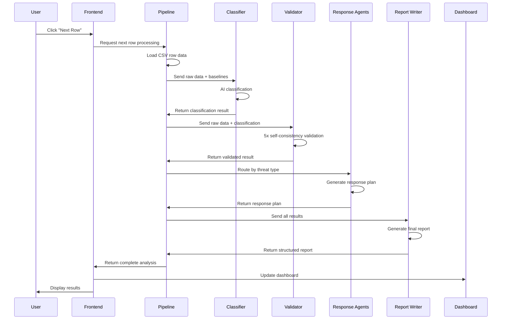

# 🏗️ CyberWatchdog System Architecture

## 📋 Table of Contents
1. [System Overview](#system-overview)
2. [High-Level Architecture](#high-level-architecture)
3. [Component Communication](#component-communication)
4. [Data Flow](#data-flow)
5. [Technology Stack](#technology-stack)
6. [Security & Error Handling](#security--error-handling)
7. [Scalability & Performance](#scalability--performance)

## 🎯 System Overview

CyberWatchdog is a **multi-agent AI-powered cybersecurity analysis system** that processes network traffic logs to detect, classify, validate, and respond to security threats in real-time. The system employs a sophisticated pipeline architecture with specialized AI agents working collaboratively to provide comprehensive threat analysis.

## 🏗️ High-Level Architecture

```
┌─────────────────────────────────────────────────────────────────────────────┐
│                           🖥️ Streamlit Frontend (main.py)                  │
│                    User Interface & Interactive Dashboard                   │
└─────────────────────┬───────────────────────────────────────────────────────┘
                      │
                      ▼
┌─────────────────────────────────────────────────────────────────────────────┐
│                        🔄 Threat Pipeline (threat_pipeline.py)             │
│                    Central Orchestrator & Flow Controller                  │
└─────────────────────┬───────────────────────────────────────────────────────┘
                      │
                      ▼
┌─────────────────────────────────────────────────────────────────────────────┐
│                           🤖 AI Agent Layer                                │
│  ┌─────────────┬─────────────┬─────────────┬─────────────┬─────────────┐   │
│  │ Classifier  │ Validator   │ Malware    │ Phishing    │ DDoS        │   │
│  │   Agent     │   Agent     │   Agent    │   Agent     │   Agent     │   │
│  └─────────────┴─────────────┴─────────────┴─────────────┴─────────────┘   │
│  ┌─────────────┬─────────────┬─────────────┐                               │
│  │ Data Breach │ Brute Force │ Report     │                               │
│  │   Agent     │   Agent     │ Writer     │                               │
│  └─────────────┴─────────────┴─────────────┘                               │
└─────────────────────┬───────────────────────────────────────────────────────┘
                      │
                      ▼
┌─────────────────────────────────────────────────────────────────────────────┐
│                        📊 Reporting & Visualization                        │
│  ┌─────────────┬─────────────┐                                             │
│  │ Dashboard   │ Report      │                                             │
│  │ (dashboard.py) │ Writer   │                                             │
│  └─────────────┴─────────────┘                                             │
└─────────────────────┬───────────────────────────────────────────────────────┘
                      │
                      ▼
┌─────────────────────────────────────────────────────────────────────────────┐
│                           🗄️ Data Layer                                   │
│  ┌─────────────┬─────────────┬─────────────┐                               │
│  │ Network     │ System      │ Threat      │                               │
│  │ Traffic     │ Event       │ Intelligence│                               │
│  │ Logs        │ Logs        │ Data        │                               │
└─────────────────────┴─────────────┴─────────────┘
```

## 🔄 Component Communication

### 1. **Frontend Layer (main.py)**
- **Role**: User interface and interaction controller
- **Communication**: 
  - Receives user commands (Next Row, Reset, Batch Processing)
  - Sends data to ThreatPipeline for processing
  - Receives analysis results and displays them
  - Manages session state and user preferences

### 2. **Pipeline Layer (threat_pipeline.py)**
- **Role**: Central orchestrator and flow controller
- **Communication**:
  - **Input**: Receives CSV data and user commands from frontend
  - **Output**: Sends processed results back to frontend
  - **Internal**: Coordinates all AI agents in sequence
  - **State Management**: Maintains processing index and results cache

### 3. **AI Agent Layer**
Each agent is a specialized AI component with specific responsibilities:

#### **Classifier Agent (classifier_agent.py)**
- **Input**: Raw network log data + baseline statistics
- **Output**: Initial threat classification (type, severity, IOCs, signature)
- **Communication**: Receives data from pipeline, sends classification back

#### **Validator Agent (validator_agent.py)**
- **Input**: Raw data + initial classification
- **Output**: Validated classification with confidence score
- **Communication**: Receives from classifier, sends validation to pipeline

#### **Specialized Response Agents**
- **Malware Agent**: Handles malware, ransomware, trojans
- **Phishing Agent**: Handles social engineering, credential harvesting
- **DDoS Agent**: Handles volumetric attacks, botnet mitigation
- **Data Breach Agent**: Handles exfiltration, insider threats
- **Brute Force Agent**: Handles authentication abuse

#### **Report Writer Agent (report_writer.py)**
- **Input**: All analysis results (classification, validation, response)
- **Output**: Structured incident report in markdown format

### 4. **Reporting Layer**
- **Dashboard (dashboard.py)**: Real-time visualizations and metrics
- **Report Writer**: Final structured reports and documentation

### 5. **Data Layer**
- **Network Traffic Logs**: Primary input data (CSV format)
- **System Event Logs**: Additional context data
- **Threat Intelligence**: Reference data for analysis

## 🤝 Inter-Agent Communication Patterns

### **Communication Architecture Overview**

The agents communicate through a **hierarchical orchestration pattern** where the ThreatPipeline acts as the central coordinator, managing all inter-agent communication and data flow.

```
                    ┌─────────────────────────────────────┐
                    │         ThreatPipeline              │
                    │      (Central Coordinator)          │
                    └─────────────────┬───────────────────┘
                                      │
                    ┌─────────────────┼───────────────────┐
                    │                 │                   │
                    ▼                 ▼                   ▼
            ┌─────────────┐   ┌─────────────┐   ┌─────────────┐
            │ Classifier  │   │ Validator  │   │ Response    │
            │   Agent     │   │   Agent     │   │   Agents    │
            └─────────────┘   └─────────────┘   └─────────────┘
                    │                 │                   │
                    └─────────────────┼───────────────────┘
                                      │
                                      ▼
                              ┌─────────────┐
                              │   Report    │
                              │   Writer    │
                              └─────────────┘
```

### **Detailed Inter-Agent Communication**

#### **1. Classifier Agent ↔ Validator Agent**
- **Communication Pattern**: Sequential handoff with data enrichment
- **Data Flow**: 
  - Classifier sends: `{"threat_type": "Malware", "severity": "High", "iocs": ["192.168.1.100"], "signature": "suspicious_connection"}`
  - Validator receives: Raw log data + classification result
  - Validator performs: 5x self-consistency checks
  - Validator returns: Enhanced classification with confidence score
- **Communication Method**: Direct function calls through pipeline
- **Data Format**: JSON objects with consistent schema

#### **2. Validator Agent ↔ Specialized Response Agents**
- **Communication Pattern**: Conditional routing based on threat type
- **Routing Logic**:
  ```python
  # In threat_pipeline.py
  threat_type = validation.get("threat_type", "Unknown")
  if threat_type.lower() == "malware":
      response = self._generate_response_plan("malware", validation, row)
  elif threat_type.lower() == "phishing":
      response = self._generate_response_plan("phishing", validation, row)
  # ... other threat types
  ```
- **Data Flow**: Validated classification → Threat type detection → Agent selection → Response generation
- **Communication Method**: Function calls with threat type as routing parameter

#### **3. Specialized Response Agents ↔ Report Writer Agent**
- **Communication Pattern**: Aggregation and consolidation
- **Data Flow**:
  - All agents send results to pipeline
  - Pipeline consolidates: `{classification, validation, response}`
  - Report Writer receives consolidated data
  - Generates structured markdown report
- **Communication Method**: Data aggregation through pipeline

#### **4. Cross-Agent Data Sharing**
- **Shared Context**: Baseline statistics from training data
- **Common Data Schema**: Consistent JSON structure across all agents
- **State Persistence**: Results stored in pipeline for dashboard access

### **Agent Communication Protocols**

#### **Data Exchange Format**
All agents use a standardized JSON schema for communication:

```json
{
  "threat_type": "string (enum)",
  "severity": "string (enum)", 
  "confidence": "float (0-1)",
  "iocs": ["array of strings"],
  "signature": "string",
  "timestamp": "string",
  "metadata": "object"
}
```

#### **Error Handling & Fallbacks**
- **LLM Failures**: Automatic fallback to rule-based classification
- **Data Validation**: Schema validation before agent processing
- **Graceful Degradation**: Continue processing with available data
- **Error Propagation**: Errors logged and reported to user

#### **Communication Patterns Used**

1. **Request-Response Pattern**
   - Pipeline → Agent: Send data for processing
   - Agent → Pipeline: Return processed results

2. **Pipeline Pattern**
   - Sequential processing through agent chain
   - Each agent adds value to the data

3. **Observer Pattern**
   - Dashboard observes pipeline results
   - Real-time updates based on processing state

4. **Strategy Pattern**
   - Different response agents for different threat types
   - Runtime selection based on classification

### **Agent Dependencies & Coupling**

#### **Loose Coupling Design**
- **Agents are independent**: Each agent can function without knowing about others
- **Pipeline manages dependencies**: Central coordinator handles agent orchestration
- **Standardized interfaces**: Common data formats enable easy agent replacement

#### **Dependency Graph**
```
ThreatPipeline (Core)
├── Classifier Agent (Independent)
├── Validator Agent (Depends on Classifier output)
├── Response Agents (Depends on Validator output)
└── Report Writer (Depends on all previous outputs)
```

#### **Communication Latency & Performance**
- **Synchronous Processing**: Sequential execution for consistency
- **LLM API Calls**: Primary bottleneck in processing pipeline
- **Caching Opportunities**: Similar threats can reuse previous analysis
- **Batch Processing**: Multiple rows processed in sequence

## 🔄 Data Flow

### **Primary Processing Flow**



### **Detailed Processing Steps**

1. **Data Ingestion**
   - Pipeline reads CSV row by row
   - Creates baseline statistics from first 100 rows
   - Maintains processing state and index

2. **Threat Classification**
   - Raw log data sent to Classifier Agent
   - Agent analyzes network patterns, protocols, and indicators
   - Returns structured JSON with threat type, severity, IOCs

3. **Validation & Refinement**
   - Validator Agent performs 5x self-consistency checks
   - Majority voting on threat type and severity
   - Confidence scoring based on agreement level
   - Merges and deduplicates IOCs

4. **Response Generation**
   - Threat type determines which specialized agent to use
   - Agent generates actionable response plan
   - Plan includes immediate actions, containment, recovery, monitoring

5. **Report Generation**
   - Report Writer Agent consolidates all analysis
   - Creates structured markdown report
   - Includes executive summary, details, recommendations

6. **Dashboard Update**
   - Real-time visualization updates
   - Threat distribution charts
   - Severity and confidence metrics
   - Temporal trend analysis

## 🛠️ Technology Stack

### **Core Framework**
- **Streamlit**: Web application framework for frontend
- **Pandas**: Data manipulation and analysis
- **LangChain**: LLM orchestration and agent framework
- **CrewAI**: Multi-agent collaboration and task management

### **AI & ML**
- **Groq**: Primary LLM provider (fast, cost-effective)
- **OpenAI**: Fallback LLM provider (high quality)
- **Mock LLM**: Demo mode when no API keys available

### **Visualization**
- **Plotly**: Interactive charts and graphs
- **Matplotlib**: Static visualizations
- **Seaborn**: Statistical plotting

### **Data Processing**
- **NumPy**: Numerical computing
- **Scikit-learn**: Machine learning utilities

## 🔒 Security & Error Handling

### **Security Features**
- **Input Validation**: All network logs validated before processing
- **Error Handling**: Graceful handling of malformed data
- **Confidence Scoring**: Uncertainty quantification for classifications
- **Audit Trail**: Complete logging of analysis steps

### **Error Handling Strategy**
- **LLM Failures**: Automatic fallback to rule-based classification
- **Data Corruption**: Skip problematic rows with error logging
- **API Failures**: Graceful degradation to demo mode
- **Memory Issues**: Row-by-row processing to prevent memory overflow

## 📈 Scalability & Performance

### **Current Architecture Strengths**
- **Modular Design**: Easy to add new agents or modify existing ones
- **Stateless Processing**: Each row processed independently
- **Efficient Memory Usage**: Processes data incrementally
- **Parallel Processing Ready**: Agent structure supports concurrent execution

### **Scalability Considerations**
- **Horizontal Scaling**: Multiple pipeline instances can process different datasets
- **Agent Pooling**: Multiple instances of specialized agents for load balancing
- **Caching**: Results caching for repeated analysis
- **Batch Processing**: Support for processing multiple rows simultaneously

### **Performance Optimizations**
- **LLM Caching**: Cache similar analysis results
- **Baseline Optimization**: Efficient baseline calculation from training data
- **Streaming Processing**: Real-time results without waiting for completion
- **Memory Management**: Efficient data structures and garbage collection

## 🔧 Configuration & Deployment

### **Environment Configuration**
- **API Keys**: Configurable LLM provider selection
- **Processing Modes**: Cost-effective vs. detailed analysis options
- **Batch Sizes**: Configurable batch processing parameters
- **Logging Levels**: Adjustable verbosity for debugging

### **Deployment Options**
- **Local Development**: Direct Streamlit execution
- **Container Deployment**: Docker containerization
- **Cloud Deployment**: AWS, GCP, or Azure deployment
- **Hybrid Mode**: Local processing with cloud LLM services

## 🚀 Future Enhancements

### **Planned Improvements**
- **Real-time Streaming**: Process live network feeds
- **Advanced ML Models**: Integration with specialized cybersecurity ML models
- **Threat Intelligence**: Real-time threat feed integration
- **Automated Response**: Integration with security orchestration platforms
- **Multi-tenant Support**: Support for multiple organizations

### **Architecture Evolution**
- **Microservices**: Break down into independent services
- **Event-Driven**: Implement event-driven architecture for real-time processing
- **API Gateway**: RESTful API for external integrations
- **Message Queues**: Asynchronous processing with message queues

---

**🛡️ CyberWatchdog Architecture** - Designed for scalability, security, and intelligent threat detection
