# 🛡️ CyberWatchdog - Multi-Agent AI Cybersecurity Analysis System

A sophisticated, AI-powered cybersecurity analysis platform that processes network traffic logs using multiple specialized agents to detect, classify, validate, and respond to security threats in real-time.

## 🎯 Project Overview

CyberWatchdog is a **multi-agent AI-enabled Cybersecurity Watchdog** that:

1. **Reads and processes** network traffic logs from CSV files
2. **Classifies threats** into categories (Malware, Phishing, DDoS, Data Breach, Brute Force, etc.)
3. **Validates classifications** using 5x self-consistency checks
4. **Routes threats** to specialized response agents
5. **Generates comprehensive reports** with visualizations and actionable insights

## 🏗️ Architecture

```
cyberwatchdog/
│── data/                           # Raw input logs
│   └── network_traffic_logs.csv    # Sequential log data (timestamps)
│
│── agents/                         # All AI Agents (LangChain + CrewAI)
│   ├── classifier_agent.py         # Classifies threats into categories
│   ├── validator_agent.py          # Validates classification & severity
│   ├── malware_agent.py            # Handles malware response actions
│   ├── phishing_agent.py           # Handles phishing response actions
│   ├── ddos_agent.py               # Handles DDoS response actions
│   ├── data_breach_agent.py        # Handles data breach response actions
│   └── common.py                   # Shared LLM configuration
│
│── pipeline/                       
│   └── threat_pipeline.py          # Orchestrates entire flow
│
│── reporting/                      
│   ├── dashboard.py                # Visualization of attack patterns
│   └── report_writer.py            # Final structured incident reports
│
│── main.py                         # Streamlit frontend application
│── requirements.txt                # Python dependencies
└── README.md                       # This file
```

## 🔄 Data Flow

```mermaid
flowchart TD
    A[📂 CSV Logs] -->|Row by Row| B[🔍 Classifier Agent]
    B --> C[✔️ Validator Agent]
    C -->|Route by Threat Type| D[⚡ Specialized Agents]
    
    D --> D1[🛡 Malware Agent]
    D --> D2[🎣 Phishing Agent]
    D --> D3[🌐 DDoS Agent]
    D --> D4[📂 Data Breach Agent]
    
    D1 --> E[📊 Dashboard + Report]
    D2 --> E
    D3 --> E
    D4 --> E
    
    E --> F[📑 Final Report Writer]
    F --> G[🖥 User Interface]
```



## 🚀 Quick Start

### Prerequisites

- Python 3.8+
- API keys for LLM services (optional - demo mode available)

### Installation

1. **Clone the repository**
   ```bash
   git clone <repository-url>
   cd orange_hackathon
   ```

2. **Install dependencies**
   ```bash
   pip install -r requirements.txt
   ```

3. **Set up environment variables** (optional)
   ```bash
   # Create .env file
   echo "GROQ_API_KEY=your_groq_api_key" > .env
   echo "OPENAI_API_KEY=your_openai_api_key" >> .env
   ```

4. **Run the application**
   ```bash
   streamlit run main.py
   ```

### Usage

1. **Start the application** - The Streamlit interface will open in your browser
2. **Click "Next Row"** - Process network logs one by one
3. **Use batch processing** - Process multiple rows at once
4. **View results** - See real-time analysis, visualizations, and reports
5. **Generate reports** - Download comprehensive security reports

## 🎛️ Features

### 🤖 Multi-Agent AI System

- **Classifier Agent**: Analyzes network logs and identifies threat types
- **Validator Agent**: Performs 5x self-consistency validation
- **Specialized Response Agents**: 
  - Malware Agent: Ransomware, trojans, C2 beacons
  - Phishing Agent: Social engineering, credential harvesting
  - DDoS Agent: Volumetric attacks, botnet mitigation
  - Data Breach Agent: Exfiltration, insider threats

### 📊 Real-Time Dashboard

- **Overview**: Key metrics and threat distribution
- **Threat Analysis**: Severity distribution and confidence scores
- **Trends**: Temporal analysis of threats over time
- **Details**: Comprehensive analysis of each event

### 📈 Advanced Visualizations

- Interactive charts using Plotly
- Threat type distribution pie charts
- Severity and confidence histograms
- Temporal trend analysis
- Top IOCs visualization

### 📋 Comprehensive Reporting

- Structured incident reports
- Executive summaries
- Actionable recommendations
- Downloadable markdown reports

## 🔧 Configuration

### LLM Providers

The system supports multiple LLM providers with automatic fallback:

1. **Groq** (recommended) - Fast and cost-effective
2. **OpenAI** - High-quality responses
3. **Mock LLM** - Demo mode when no API keys are available

### Environment Variables

```bash
# Required for production use
GROQ_API_KEY=your_groq_api_key
OPENAI_API_KEY=your_openai_api_key

# Optional
LOG_LEVEL=INFO
```

## 📊 Data Format

The system expects CSV files with the following columns:

```csv
Source IP,Destination IP,Protocol,Packet Size (bytes),Flow Duration (s),Threat,Threat Type,Event Type,User,Success,Timestamp
```

### Sample Data

```csv
60.76.63.208,145.221.28.166,TCP,666.3,3.16,No,,Privilege Escalation,guest,Yes,20/04/24 0:00
67.230.88.161,188.188.11.5,TCP,1247.71,1.06,Yes,Phishing,Failed Login,guest,No,20/04/24 13:00
```

## 🛠️ Development

### Adding New Agents

1. Create a new agent file in `agents/`
2. Define the agent and task functions
3. Add routing logic in `pipeline/threat_pipeline.py`
4. Update the dashboard if needed

### Customizing Analysis

- Modify threat types in agent files
- Adjust validation parameters
- Customize response templates
- Add new visualization types

## 🔒 Security Features

- **Input Validation**: All network logs are validated before processing
- **Error Handling**: Graceful handling of malformed data
- **Confidence Scoring**: Uncertainty quantification for all classifications
- **Audit Trail**: Complete logging of all analysis steps

## 📈 Performance

- **Real-time Processing**: Each log entry processed in seconds
- **Batch Processing**: Handle multiple entries efficiently
- **Memory Efficient**: Processes data row by row
- **Scalable**: Easy to extend for larger datasets

## 🤝 Contributing

1. Fork the repository
2. Create a feature branch
3. Make your changes
4. Add tests if applicable
5. Submit a pull request

## 📄 License

This project is licensed under the MIT License - see the LICENSE file for details.

## 🙏 Acknowledgments

- **LangChain** - LLM orchestration framework
- **CrewAI** - Multi-agent collaboration
- **Streamlit** - Web application framework
- **Plotly** - Interactive visualizations
- **Pandas** - Data manipulation

## 📞 Support

For questions, issues, or contributions:

- Create an issue on GitHub
- Contact the development team
- Check the documentation

---

**🛡️ CyberWatchdog** - Protecting digital assets with AI-powered intelligence